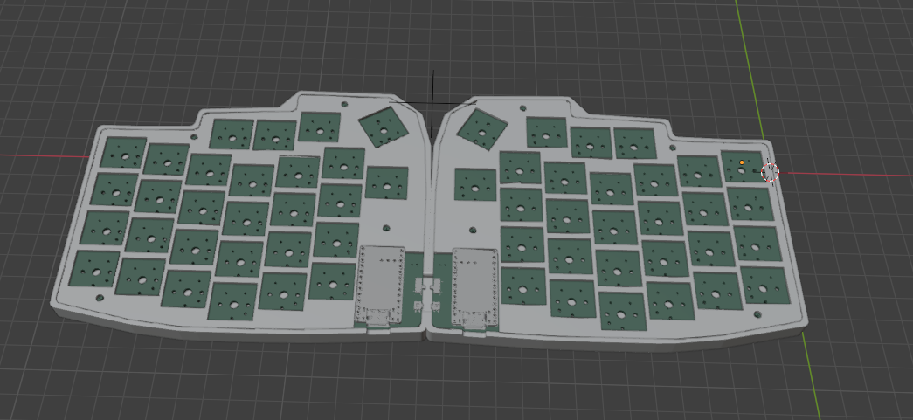
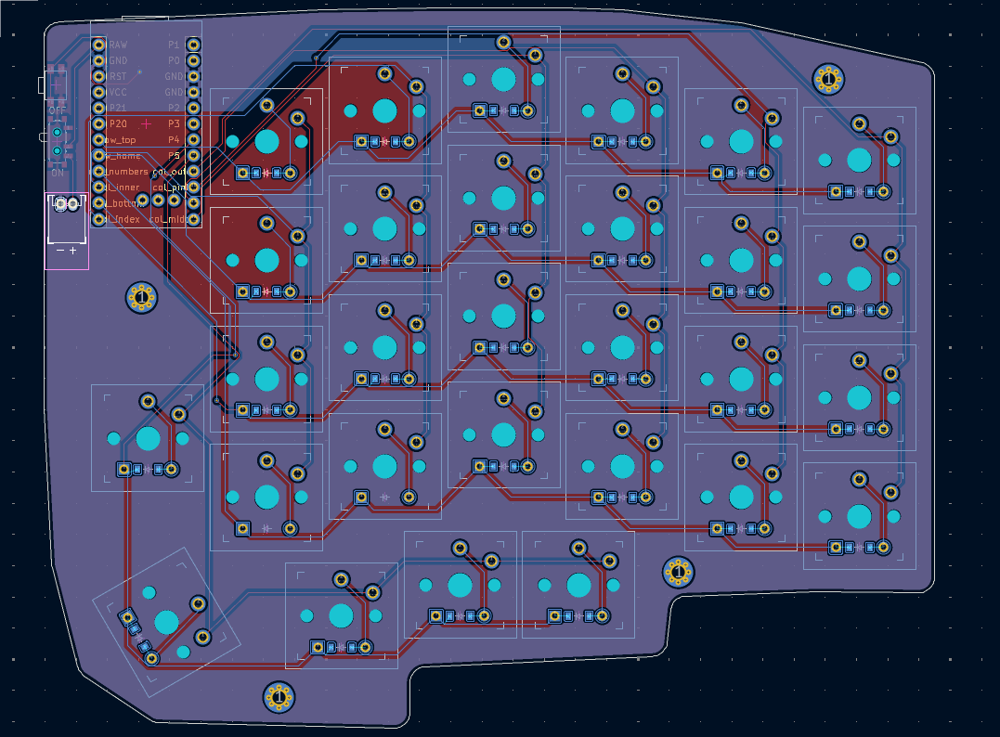

# Cloudboard

A low profile ergo keyboard inspired by the lily 58.

The keyboard is a small low profile keyboard made to be wireless and bluetooth, it features a lily 58 key layout, 110mAh battery and 2 nice!nano alternative controllers

The keyboard uses ZMK for its firmware due to how simple but effective it is for ergo and bluetooth keyboards.

## Why i made the project

Ive wanted to try out a ergo keyboard for a while now and thought it would be a fun idea to make one with the features i actually want and none of the extra parts.

## BOM

| Item                               | Count | Price       | Link                                                                                                                                                                                                                                                                                                                                                                                                                                                                                  |
| ---------------------------------- | ----- | ----------- | ------------------------------------------------------------------------------------------------------------------------------------------------------------------------------------------------------------------------------------------------------------------------------------------------------------------------------------------------------------------------------------------------------------------------------------------------------------------------------------- |
| NRF52840 Development Board         | 2     | $2.28       | [Link](https://www.aliexpress.com/item/1005006343285322.html?spm=a2g0o.productlist.main.7.21ec4874hMfMsm&algo_pvid=de022864-ba12-40a7-98e9-e40f0e4649a0&algo_exp_id=de022864-ba12-40a7-98e9-e40f0e4649a0-6&pdp_ext_f=%7B%22order%22%3A%22563%22%2C%22eval%22%3A%221%22%7D&pdp_npi=4%40dis%21USD%212.40%212.28%21%21%212.40%212.28%21%40211b807017540040839936210e2e9b%2112000036829406173%21sea%21UK%210%21ABX&curPageLogUid=YKz7SDwj0Cdl&utparam-url=scene%3Asearch%7Cquery_from%3A) |
| 1N4148 DO-35 Diodes                | 1     | $1.00       | [Link](https://www.aliexpress.com/item/1005002620170252.html?spm=a2g0o.productlist.main.2.1b71VqGmVqGmim&algo_pvid=3e213d60-42ff-48f5-9b98-4daf7d45741a&algo_exp_id=3e213d60-42ff-48f5-9b98-4daf7d45741a-1&pdp_ext_f=%7B%22order%22%3A%22139%22%2C%22eval%22%3A%221%22%7D&pdp_npi=4%40dis%21USD%210.91%210.91%21%21%216.54%216.54%21%40211b804117540048574645188e478d%2112000021432883817%21sea%21UK%210%21ABX&curPageLogUid=tuKdnHriPnWS&utparam-url=scene%3Asearch%7Cquery_from%3A) |
| Keycap Set                         | 1     | $60.74      | [Link](https://typeractive.xyz/products/mbk-60s?variant=51055755264231)                                                                                                                                                                                                                                                                                                                                                                                                               |
| JST battery connector              | 1     | $1.00       | [Link](https://typeractive.xyz/products/battery-jack?variant=45597492707559)                                                                                                                                                                                                                                                                                                                                                                                                          |
| Power switch                       | 1     | $2.00       | [Link](https://typeractive.xyz/products/power-switch?variant=45597854171367)                                                                                                                                                                                                                                                                                                                                                                                                          |
| Reset tactile button               | 1     | $2.00       | [Link](https://typeractive.xyz/products/reset-button?variant=45597784932583)                                                                                                                                                                                                                                                                                                                                                                                                          |
| Lithium Battery 110mAh             | 2     | $4.00       | [Link](https://typeractive.xyz/products/lithium-battery-110mah?variant=43294731665639)                                                                                                                                                                                                                                                                                                                                                                                                |
| Sockets and Pins                   | 1     | $6.00       | [Link](https://typeractive.xyz/products/machine-sockets-and-pins?variant=45741664501991)                                                                                                                                                                                                                                                                                                                                                                                              |
| L+R PCB                            | 1     | $10.30      | [Link](https://cart.jlcpcb.com/quote?rand=0.6702360434866385)                                                                                                                                                                                                                                                                                                                                                                                                                         |
| Kailh Choc v1 Low Profile Switches | 6     | $30.00      | [Link](https://typeractive.xyz/products/choc-switches?variant=45741919240423)                                                                                                                                                                                                                                                                                                                                                                                                         |
| Black filament                     | 1     | $24.00      | [Link](https://thepihut.com/products/jet-black-pla-filament-1-75mm-1kg?variant=41404468035779)                                                                                                                                                                                                                                                                                                                                                                                        |
|                                    |       | **$143.32** |                                                                                                                                                                                                                                                                                                                                                                                                                                                                                       |

notes: 
- VAT is included but shipping is not since it varies, will typically end up at arround 7-10 dollars
- most parts picked from typeractive for conviniece since it has the keycaps and switches + most components needed and also to keep shipping costs low