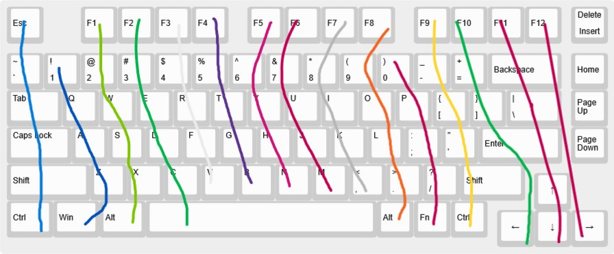

# June 14th: 

I did basic research on what goes into making a low profile keyboard and the differences when designing it, i decided on a wired keyboard since i want it to be small and it is generally just easier to design a wired one, i also found a 75% to be the best for me. Picture of layout below:

**Total time spent: 1h**

# June 16th: 

Did more research and resetup kicad, i looked through a bunch of boards and found the nice!nano, the nice!nano honestly seemed great for the build but costing arround 30$ for a microcontroller seemed like a bad idea, i went back to look for another board and ended up finding this:

[Supermini NRF52840](https://www.aliexpress.com/item/1005006019812115.html)
This is a really good alternative to the nice nano, it is considered Nice!Nano compatible meaning any info i find on the nice!nano will be relevant to this board, also significantly cheaper then the other board coming in at ￡7.79

One of the main reasons i really like this board is the fact it is bluetooth and has charging managment, making my life much easier and brings bluetooth back as an option.

I also did look for a dongle reciver and stumbled across the [nRF52840 Dongle](https://www.nordicsemi.com/Products/Development-hardware/nRF52840-Dongle), it is zmk compatible which is one of the main reasons its good but i dislike the bulkyness and think ill keep looking
 
**Total time spent: 1h**

# June 26th: 

Designed the schematic in kicad and changed the layout

the new layout adds more functionality and buttons but im stuck on how i am going to fit the dev board on the new design, i also created the key layout schematic in kicad:

but the dev board i am using has one less gpio pin to what i need so i either need to pick a dev dev board, not use a dev board at all or optimise the matrix more.
i also researched some stiff on the material and came to the realisation that having my case cnc'd would be way to expensive. So right now i am planning on 3d printing it with a unique stratergy with nylon using a 3d printing method called MJF, i think it will come to arround 60 dollars but i can only tel when my case is done

 
**Total time spent: 3h**

# June 28th: 

I came to the realisation that a dev board just wouldnt fit and the keyboard wouldnt be as compact as a wanted if i wanted to use one, so i am now embedding the microcontroller on to the pcb. I started with adding a usb c receptacle but kept hitting more and more issues as i went along, i ended up with this after 3 hours of work:

What i tried to do was use a IC to controll the battery so the battery wasnt charging all the time and the keyboard could either be wired or wireless, i also plan to use a 2 pin battery connector in case i ever need to replace the battery. Overall it has been very overwhelming and ill come back to it later because im 80% sure it wont work. I am now also using [ai03s guide](https://wiki.ai03.com/books/pcb-design) to try and simplify what i need to do.

 
**Total time spent: 3.5h**

# July 2nd

Still working on embedding the microcontroller, found ai03s guide very helpful and ended up with this

This was great progress and everything seemed like it worked, the guide was very helpful at explaining what things did and what to do next but i quickly ran into the issue of running out of gpio pins, the microcontroller i was using (ATmega32U4) just didnt have enough pins unless i wanted to optimise my matrix. This really wasnt great as i wanted to make designing the pcb itself after the schematic as easy as possible and didnt want routes all over the place.

I then decided on the rp2040 which had enough io pins for the layout i wanted. I found [this guide](https://www.youtube.com/watch?v=6Z49bynRqj8) very helpful at the begining as it showed how to correctly wire the microcontroller with the crystal and flash memory along with a usb c port. After following i ended up with this:

# July 6th

Havent posted a log for a while because it has been very on and off, i have pretty much decided on the FINAL mcu i will use for the keyboard, the [MDBT50Q-1MV2](https://www.raytac.com/product/ins.php?index_id=24), it has everything i need like a built in antenna and a usb interface making my life so much easier. Appart from that it has just been integrating everything from past designs into one complete circuit, making this:

**Total time spent: 2h**

# July 9th

Ive been working on routing the pcb and have got to this point:

This is great progress for me and the pcb is fully complete now, unless i add drill holes later. The keyboard uses a GND filled zone, this is to make the routing neater in general and can help with heat. Ive puposefully moved all the smd parts to the back since i am planning on getting them assembled, this is due to me not being skilled enough at soldering to properly soldier the parts properly. 3d render of the pcb:

Getting the board assembeled might be expensive though. just on jlcpcb alone your required to assemble at least 2 boards which quoted me at arround 50 dollars for 2 assembled boards, 3 empty.

**Total time spent: 3h**

# July 11th

Once again ive decided to full 180 which is really unfortunate, the mcu module i was using was out of stock on jlcpcb and since there were pins on the underside, it wouldnt be possible to soldier myself. Ive decided to back track a bit and will use the Supermini, the nice!nano clone to allow for a bluetooth keyboard. I am gonna create a ergo keyboard instead and will base it off the lily 58 layout, the lilly 58 is a entry level ergo split keyboard and is a great place to start. 

the reason it is entry level is due to the amount of keys it has which can remove efficiency but i think it will be fine. The pcb will be way easier to create then the other one and i will have to start from scratch but i am happy to switch over to this idea.

**Total time spent: 1h**

# July 11th

Fully finished the schematic, i was gonna use 2 oled displays but then checked zmk's battery profiler and decided against it, this is because it would cut my battery life down by 7 times which isnt really what i want. I made 2 different matrixes for each half of the keyboard along with their own microcontrollers since better battery life + the microcontrollers are cheap so its actually easier this way

**Total time spent: 2h**

# July 15th

Left hand side pcb is done! Im happy with how it turned out. Designing the first keyboard helped quite alot in routing this one and hope it works well, just need to copy it over for the right hand side now and i can start working on the case which i think will be the hardest part

**Total time spent: 1h**

# July 30th

After a couple weeks of procrastinating, designing in kicad became too much, it was impossible to flip the keyboard onto its right side due to the way everything is set out and i became stuck and just used ergogen. Ergogen wasnt really much easier as i found little documentation for stuff, i honestly dont know how much time i spent researching small things but it was too long so im only going to count the time it took inside of the editor. I currently have a roughly 400 line config which defines the switch layout, pcb and a bit of the case, i still need to add screws and wire the pcb but ergogen was a great help and allows for a perfectly symetrical keyboard

[This guide](https://flatfootfox.com/ergogen-part4-footprints-cases/) was a great help in making this but ergogen still takes a huge amount of time and isnt as proficient as using your standard tools

**Total time spent: 4h**

